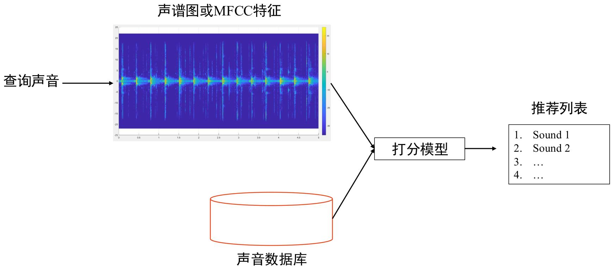
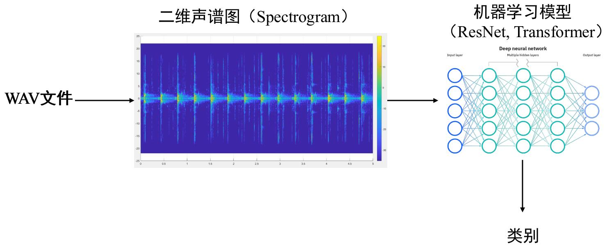

# 《数字信号处理》大作业说明 声音检索与分类 

## 数据集 

https://github.com/karolpiczak/ESC-50 

<table><tr><td>Animals</td><td>Natural soundscapes &amp; water sounds</td><td>Human, non-speech sounds</td><td>Interior/domestic sounds</td><td>Exterior/urban noises</td></tr><tr><td>Dog</td><td>Rain</td><td>Crying baby</td><td>Door knock</td><td>Helicopter</td></tr><tr><td>Rooster</td><td>Sea waves</td><td>Sneezing</td><td>Mouse click</td><td>Chainsaw</td></tr><tr><td>Pig</td><td>Crackling fire</td><td>Clapping</td><td>Keyboard typing</td><td>Siren</td></tr><tr><td>Cow</td><td>Crickets</td><td>Breathing</td><td>Door, wood creaks</td><td>Car horn</td></tr><tr><td>Frog</td><td>Chirping birds</td><td>Coughing</td><td>Can opening</td><td>Engine</td></tr><tr><td>Cat</td><td>Water drops</td><td>Footsteps</td><td>Washing machine</td><td>Train</td></tr><tr><td>Hen</td><td>Wind</td><td>Laughing</td><td>Vacuum cleaner</td><td>Church bells</td></tr><tr><td>Insects (flying)</td><td>Pouring water</td><td>Brushing teeth</td><td>Clock alarm</td><td>Airplane</td></tr><tr><td>Sheep</td><td>Toilet flush</td><td>Snoring</td><td>Clock tick</td><td>Fireworks</td></tr><tr><td>Crow</td><td>Thunderstorm</td><td>Drinking, sipping</td><td>Glass breaking</td><td>Hand saw</td></tr></table>

数据集 

• audio/*.wav 

2000 audio recordings in WAV format (5 seconds, 44.1 kHz, mono) with the following naming convention: 

{FOLD}-{CLIP_ID}-{TAKE}-{TARGET}.wav 

○ {FOLD} - index of the cross-validation fold, 

○ {CLIP_ID} - ID of the original Freesound clip, 

○ {TAKE} - letter disambiguating between different fragments from the same Freesound clip, 

○ {TARGET} - class in numeric format [0, 49].

## 任务1：声音检索 

作业要求 

【代码实现】 

- 需要自己实现FFT、STFT、MFCC等算法。 

- 利用最后1个fold作为查询声音，前4个fold作为候选数据库，判断Top10、Top20中找到相同类别声音的精度。 

- 需要比较不同的帧移、帧长等超参数下的精度。

## 任务2：声音分类  

作业要求 

【代码实现】 

- 需要自己实现FFT、STFT、MFCC等算法。 

- 可以自由选择不同的神经网络模型，可以直接调用已有的模型和训练代码。 

- 需要比较不同的帧移、帧长等超参数下模型的分类精度。 

- 利用前4个fold进行训练，利用最后1个fold进行测试。 

- 将该模型用于前面检索任务，对比有无机器学习的效果。 

- 需要与大模型直接分类做对比。

作业要求 

分数：50分 

时间：16周上课前一天提交所有材料，16周进行项目展示 

组队要求：不超过5人，报告需要明确每个人的角色和职责 

【提交内容】 

建议使用Pytorch。 

报告1份：实现的流程、训练曲线、测试精度、不同setting的比较等。 

代码1份：包括readme、requirement。
